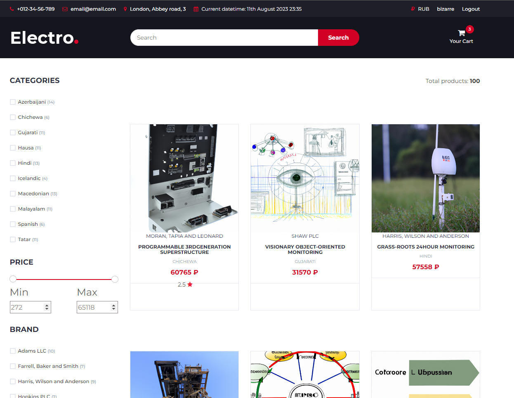

Интернет-магазин товаров на Django + Bootstrap.

Есть личный кабинет, регистрация, корзина, поиск, сортировка, отзывы о товаре и пр.
Есть Celery с брокером Redis для e-mail задач.

Можно генерировать данные в таблицах БД с помощью Faker.
Описание и картинки к товару можно генерировать с помощью OpenAI.




### Для запуска проекта необходимо:

Установить зависимости:

```bash
pip install -r requirements.txt
```

Создать базу, прогнать миграции, создать админа:

```bash
python manage.py makemigrations
python manage.py migrate --run-syncdb 
python manage.py createsuperuser
```

Собрать статические файлы в папку 'static'
```bash
python manage.py collectstatic
```
Выполнить команду:

```bash
python manage.py runserver <IP-address>:8000
```


Заполнение таблиц фэйковыми данными с помощью [Faker](https://faker.readthedocs.io/en/master/index.html):
```bash
python manage.py shell  
```
```bash
from authorization.factories import ContactFactory

ContactFactory.create_batch(25)
```
```bash
from backend.factories import *

BrandFactory.create_batch(15)

ShopFactory.create_batch(30)

CategoryFactory.create_batch(10)

ParameterFactory.create_batch(10)

ProductInfoFactory.create_batch(100)
```

Заполнение значений параметров в таблице M2M "productsparameters" 
```bash
set_param_values()
```
Генерация изображения и описания к товару по его названию. Через [OpenAI API](https://platform.openai.com/docs/guides/images/image-generation-beta).
Ограничение 5 запросов/минуту. 
```bash
generate_products_pics()

generate_products_descriptions()
```

Запуск воркера:
```bash
celery -A shop worker -l info
```

Запуск воркера под виндой:
```bash
pip install gevent
```
```bash
celery -A shop worker -l info -P gevent
```
